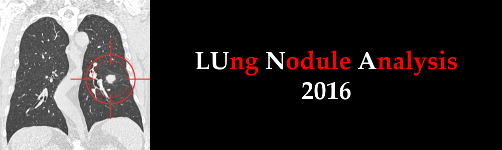
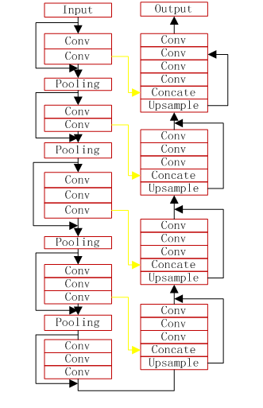
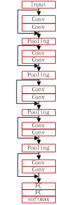
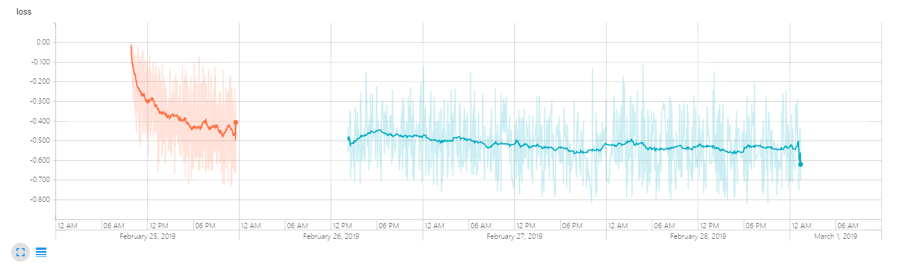
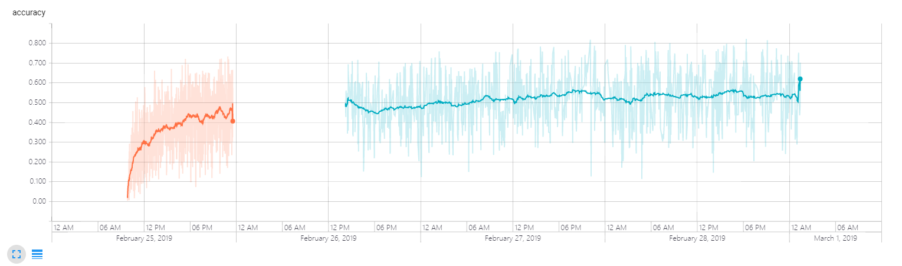
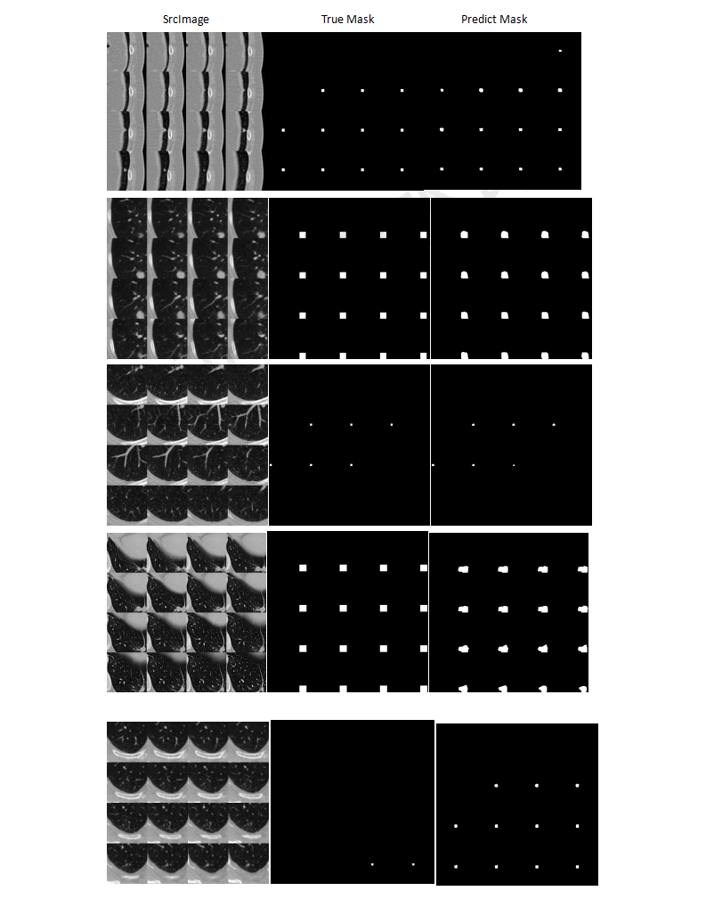
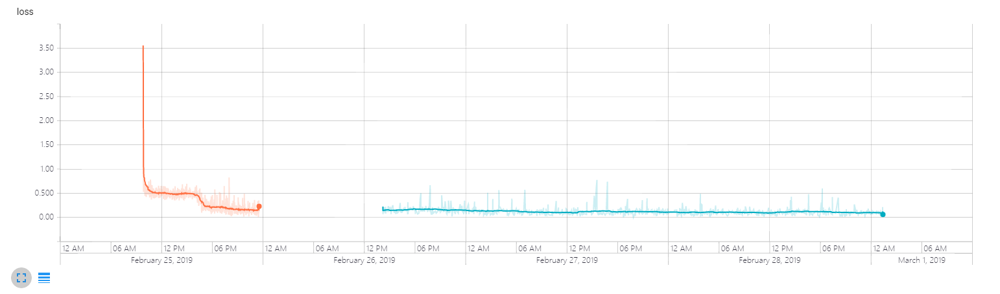
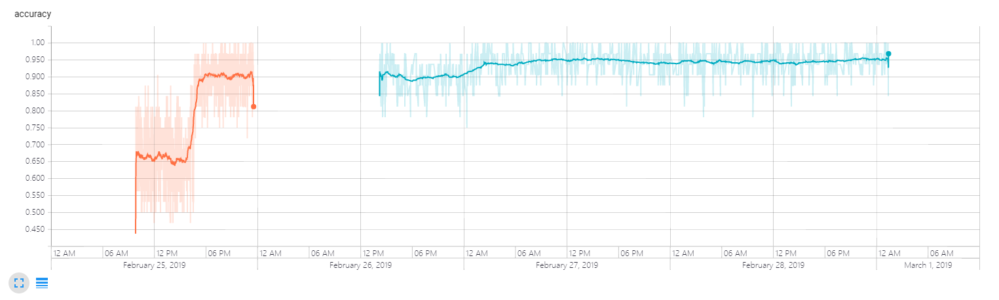
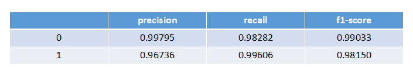

# LUNA16-LUng-Nodule-Analysis-2016-Challenge
> This is an example of the CT images lung nodule detection and false positive reduction from LUNA16-LUng-Nodule-Analysis-2016-Challenge

## Prerequisities
The following dependencies are needed:
- numpy >= 1.11.1
- SimpleITK >=1.0.1
- opencv-python >=3.3.0
- tensorflow-gpu ==1.8.0
- pandas >=0.20.1
- scikit-learn >= 0.17.1

## How to Use

**1、Preprocess**

**nodule detection**

* convert annotation.csv file to image mask file:run the LUNA_mask_extraction.py
* analyze the ct image,and get the slice thickness and window width and position:run the dataAnaly.py
* generate lung nodule ct image and mask:run the data2dprepare.py
* generate patch(96,96,16) lung nodule image and mask:run the data3dprepare.py
* save lung nodule data and mask into csv file run the utils.py,like this:G:\Data\segmentation\Image/0_161....

**nodule classify**

* convert candidates.csv file to nodule and not-nodule image(48,48,48):run the LUNA_node_extraction.py
* Augment the nodule image data: run the Augmain.py
* split data into train data(80%) and test data(20%):run the subset.py
* save lung nodule data and label into csv file like this:1,G:\Data\classify\1_aug/0_17.npy

**2、Nodule Detection**
* the VNet model

 

* train and predict in the script of vnet3d_train.py and vnet3d_predict.py

**3、False Positive Reducution**
* the ResVGGNet model

* train and predict in the script of ResNet3d_train.py and ResNet3d_predict.py

**4、download trained model**
* i have shared the trained model of nodule detection and false positive reduction on here: https://pan.baidu.com/s/1I7zhzmPsTCbz0ZeIntNrUA ,password:orpm

## Result

**1、Nodule Detection**

* train loss and train accuracy

* the segment result

**2、False Positive Reducution**

* train loss and train accuracy

* ROC,Confusion Matrix and Metrics

## Contact
* https://github.com/junqiangchen
* email: 1207173174@qq.com
* Contact: junqiangChen
* WeChat Number: 1207173174
* WeChat Public number: 最新医学影像技术
